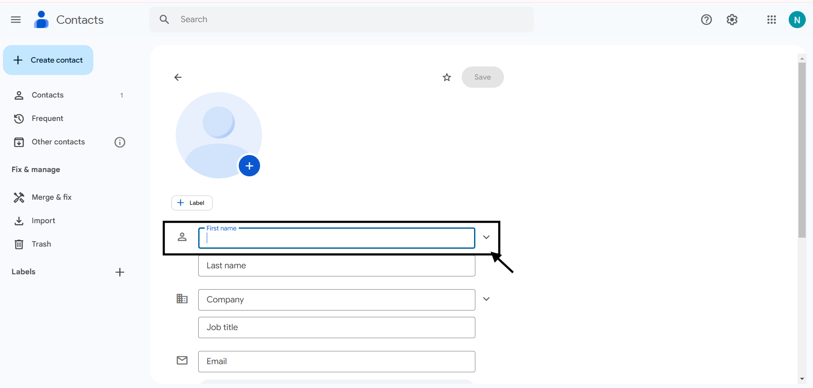

# Add a contact
On your computer, go to Google Contacts.

At the top left, click Create contact.
(Click Create a contact or Create multiple contacts.)

Enter the contact's information.

Click Save.

