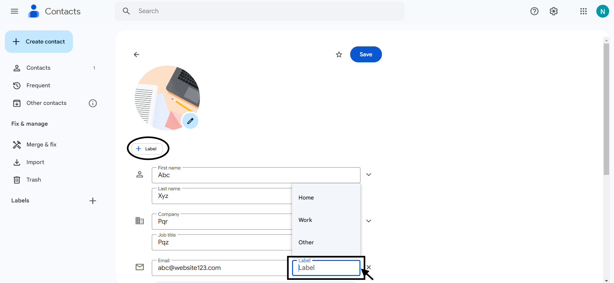
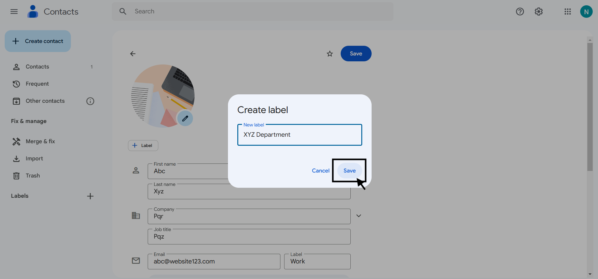
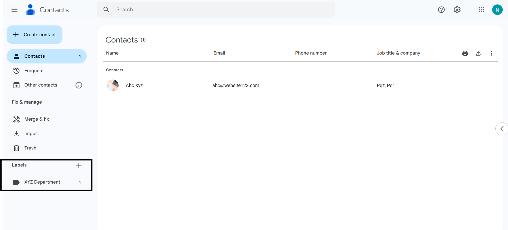

# Create and Manage labels
The 'labels' allows you to create groups.
- Go to Google Contacts.

- On the left next to "Labels," click Create label .

 
  
- Type a name, then click Save.

- Your label is created.
  

